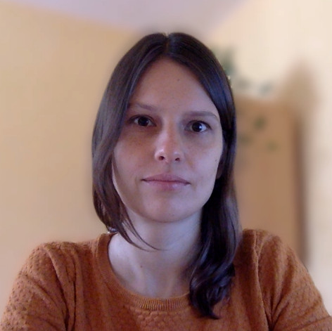

I am a researcher in corpus linguistics and computational linguistics at the [Institute for Natural Language Processing](https://www.ims.uni-stuttgart.de/) at the University of Stuttgart. In my linguistic research, I am interested in how registers and text genres work, with a focus on German academic language. Most of my work today goes beyond the borders of linguistics: In the field of digital humanities, I collaborate with researchers from other humanities and social sciences like literary studies, cultural anthropology and philosophy. We investigate how methods from corpus linguistics and computational linguistics can contribute to all kinds of text related research. For details, please see [research]() and [publications]().

In Stuttgart, I teach [courses]() in the master program Digital Humanities. I am passionate about teaching computational linguistics and programming to people from the humanities, because I myself started my academic education with a traditional program in German Studies and later found my way into computational and quantitative research.

Pronouns: she/her

ORCID:  [0000-0002-3913-1273](https://orcid.org/0000-0002-3913-1273) 
